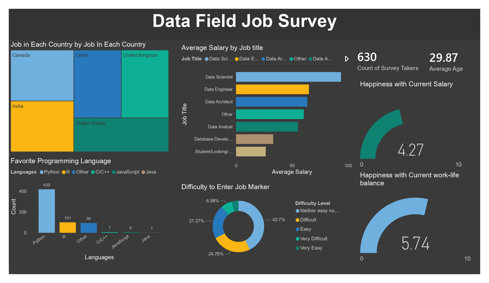

# Data Field Job Survey Dashboard (Power BI)

## 📊 Project Overview
This project presents an interactive **Power BI dashboard** built using survey data collected from **Twitter (X)**, focusing on professionals working in the **data field** — including **Data Science, Data Engineering, Data Analysis, and Data Architecture** roles.

The goal of this project is to extract meaningful insights from raw survey data and present them in a clear, decision-friendly visual format.

---

## 🎯 Objectives
- Understand global trends in data-related jobs
- Analyze salary distribution across roles and countries
- Identify popular programming languages in the data industry
- Explore demographic patterns such as age and location

---

## 🧹 Data Cleaning & Preparation
Before visualization, the dataset underwent extensive cleaning and transformation:
- Removed duplicates and irrelevant records
- Handled missing and inconsistent values
- Standardized job titles and country names
- Converted salary and age fields into usable formats
- Created calculated columns and measures using **DAX**

This step ensured the dashboard reflects **accurate and reliable insights**.

---

## 📈 Key Insights Visualized
The dashboard includes the following key metrics and visuals:
- **Total Survey Responses**
- **Average Age of Respondents**
- **Job Roles Distribution**
- **Country-wise Survey Participation**
- **Average Salary by Role**
- **Favorite Programming Languages**
- **Comparative analysis across data roles**

All visuals are interactive and allow filtering for deeper exploration.

---

## 🛠 Tools & Technologies
- **Power BI**
- **Power Query**
- **DAX**
- **Data Cleaning & Transformation**
- **Data Visualization & Analysis**

---

## 💡 Skills Demonstrated
- End-to-end data analysis workflow
- Data cleaning and preprocessing
- Business-focused dashboard design
- Analytical thinking and insight generation
- Storytelling with data

---

## 📌 Conclusion
This project demonstrates my ability to transform raw, unstructured survey data into a **clear, insightful, and professional dashboard**.  
It highlights both **technical proficiency** and **analytical reasoning**, making it suitable for real-world business and data-driven decision-making scenarios.

---

📷 *Dashboard snapshot shown above is taken directly from the Power BI report.*